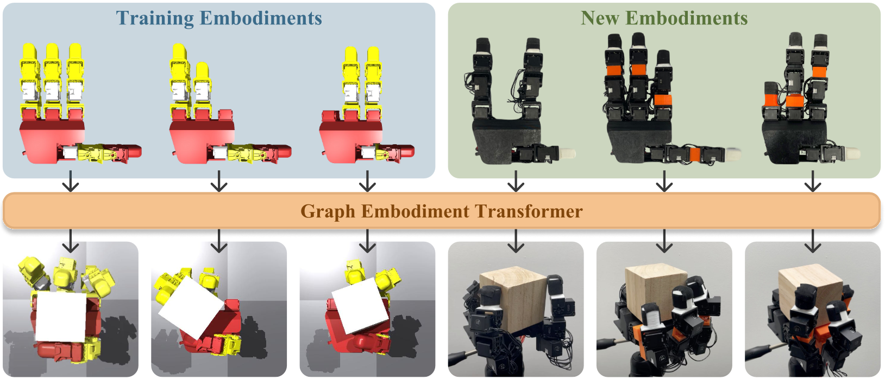

# GET-Zero: Graph Embodiment Transformer for Zero-shot Embodiment Generalization

[Austin Patel](https://austinapatel.github.io), [Shuran Song](https://shurans.github.io) | Stanford University

[Project Page](https://get-zero-paper.github.io) | [Paper]() | [Dataset (Checkpoints and demonstration data)](https://drive.google.com/drive/folders/1weRRB0YLxTxtuEV44FvWCg8Z1k1fM9sJ?usp=share_link)



## Abstract

This paper introduces GET-Zero, a model architecture and training procedure for learning an embodiment-aware control policy that can immediately adapt to new hardware changes without retraining. To do so, we present Graph Embodiment Transformer (GET), a transformer model that leverages the embodiment graph connectivity as a learned structural bias in the attention mechanism. We use behavior cloning to distill demonstration data from embodiment-specific expert policies into an embodiment-aware GET model that conditions on the hardware configuration of the robot to make control decisions. We conduct a case study on a dexterous in-hand object rotation task using different configurations of a four-fingered robot hand with joints removed and with link length extensions. Using the GET model along with a self-modeling loss enables GET-Zero to zero-shot generalize to unseen variation in graph structure and link length, yielding a 20\% improvement over baseline methods.

## Table of Contents

- [GET-Zero: Graph Embodiment Transformer for Zero-shot Embodiment Generalization](#get-zero-graph-embodiment-transformer-for-zero-shot-embodiment-generalization)
  - [Abstract](#abstract)
  - [Table of Contents](#table-of-contents)
  - [About](#about)
  - [Getting Started](#getting-started)
  - [Setup \& Installation](#setup--installation)
    - [With Docker](#with-docker)
    - [Without Docker](#without-docker)
  - [Dataset](#dataset)
    - [Contents](#contents)
    - [Setup](#setup)
  - [Procedural LEAP Hand Generation](#procedural-leap-hand-generation)
    - [Visualizing Generated LEAP Assets](#visualizing-generated-leap-assets)
  - [Train and Test RL Experts](#train-and-test-rl-experts)
    - [Generate Grasp Cache](#generate-grasp-cache)
    - [RL Training Runs](#rl-training-runs)
    - [Launching single training run](#launching-single-training-run)
    - [Testing embodiment-specific RL expert](#testing-embodiment-specific-rl-expert)
  - [Train and Test Embodiment-aware GET Model](#train-and-test-embodiment-aware-get-model)
    - [Prepare training](#prepare-training)
    - [Start training](#start-training)
    - [Testing a GET checkpoint (all embodiments)](#testing-a-get-checkpoint-all-embodiments)
    - [Testing a GET checkpoint (single embodiment)](#testing-a-get-checkpoint-single-embodiment)
  - [Replicating Simulation Paper Results](#replicating-simulation-paper-results)
  - [Real-world Deployment](#real-world-deployment)
    - [Assembly](#assembly)
    - [Reset Hand](#reset-hand)
    - [Camera Setup](#camera-setup)
    - [Deploy Policy](#deploy-policy)
  - [Misc](#misc)
  - [Support](#support)
  - [Acknowledgments](#acknowledgments)

## About

This repository contains the code needed to reproduce the results in the paper as well a number of key components which we hope will be useful in future research projects. Namely:
- Procedural generation of [LEAP Hand](https://leaphand.com) hardware configuration assets
- LEAP Hand RL training environment setup with Isaac Gym leveraging [IsaacGymEnvs](https://github.com/isaac-sim/IsaacGymEnvs) and [rl_games](https://github.com/Denys88/rl_games?tab=readme-ov-file) that supports hardware configurations of the LEAP Hand with different DoF counts and logging behavior data
- PyTorch graph embodiment transformer (GET) model architecture with embodiment tokenization, self-modeling head, and graph attention mechanism which supports control of multiple embodiments with varying DoF counts
- GET training scripts for performing behavior cloning using demonstration data across a variety of hand designs and support for asynchronous evaluation of policies in Isaac Gym during training
- Scripts for deploying trained GET models on various hardware configurations of the LEAP Hand in the real world with AR tag tracking for evaluation
- A general purpose Isaac Gym viewer script which can visualize and interact with assets in a GUI

## Getting Started
To start off, we recommend trying the following:

1. Setup the development environment either with Docker or manually in a Conda environment (don't worry yet about downloading the dataset). See [Setup \& Installation](#setup--installation) for more details.

```bash
# first copy in Isaac Gym dependency as mentioned in Setup & Installation section
wandb login # on host
# create project with name `get_zero`on W&B
./docker/build.sh
./docker/run.sh
./docker/attach.sh
```

2. Verify that you can run the viewer command to visualize one of the LEAP hand assets in a window (See X11 setup in [Setup \& Installation](#setup--installation) to get GUI working if using remote server)
```bash
# if you don't have GUI setup, you can skip this step
cd get_zero/rl/
python viewer.py --asset leap/leap_hand/generated/urdf/001.urdf
```
3. Test one of the provided pretrained checkpoints for the embodiment-specific expert for one of the procedurally generated embodiments in simulation to perform the in-hand rotation task.

```bash
# W&B setup can be skipped by providing `wandb_activate=false`
# Verify that you see the video logged of the hand completing the task (get_zero/rl/runs/...) as well as metrics logged to W&B.
cd get_zero/rl/
python train.py test=true embodiment=LeapHand/generated/139.yaml checkpoint=../../checkpoints/LeapHand/embodiment_specific/139.pth
```

4. Test the in-hand rotation GET model in simulation on any embodiment.
```bash
# After testing 139 with GET, try changing the embodiment to a different one (images in get_zero/rl/assets/leap/leap_hand/generated/image), but you don't need to change the model checkpoint you use since GET is embodiment-aware!
# Look at video in run directory
cd get_zero/rl
python train.py test=true model=generic/TransformerBase checkpoint=../../checkpoints/LeapHand/embodiment_aware/GET.pt embodiment=LeapHand/generated/139.yaml
```

5. Either try training a GET model yourself (requires downloading the dataset at this point) or explore real-world deployment. See the rest of the README for how to do this!

## Setup & Installation

Download [Isaac Gym Preview 4](https://developer.nvidia.com/isaac-gym) and move it to `<repo root>/dependencies/isaacgym`. You will need to create the `dependencies` folder.

### With Docker
Docker is the recommended way to reproduce results in this project. To run with Docker you need to have the NVIDIA Container Toolkit setup (see instructions [here](https://docs.nvidia.com/datacenter/cloud-native/container-toolkit/latest/install-guide.html)).

If you would like to use W&B, make sure to do `wandb login` on the host machine (not inside the container) and also create a project with name `get_zero` on W&B. The run script below will mount the W&B credentials into the container.

Docker lifecyle commands:
```bash
./docker/build.sh
./docker/run.sh
./docker/attach.sh
./docker/exit.sh
```

If using SSH to connect to a server running Docker and you wish to use a display, make sure X11 forwarding is enabled in your SSH config. Then, in a new terminal run `./docker/fix_xauthority.sh` on host (keep this terminal session open so that the `.Xauthority` is kept valid/alive) and then run `. ~/.fix_display` in the running container to ensure `$DISPLAY` and `.Xauthority` are synchronized between the host and container. You can test this is working by running `xeyes` in the container which should open a simple GUI.

Note there are optional command line arguments to these scripts if you wish to use a custom container name and depending on the data you wish to mount inside the container (see `./docker/run.sh` in particular).

If using VS Code you can attach to the Docker container and open the workspace `.vscode/docker.code-workspace`. This workspace also opens the `/opt` folder which is where many of the dependencies are installed.

### Without Docker
Follow the environment setup steps within the [Dockerfile](docker/Dockerfile) to install required dependencies (though the repos can be installed through pip rather than manually cloining and installing in editable mode as is done in the Dockerfile).

Though it is recommended to look at all dependencies setup in the Dockerfile, the basic Python dependencies can be setup through:
```bash
cd isaacgym/python && pip install -q -e .
cd <repo root> && pip install -e .
```

## Dataset
You will need to download the dataset if you wish to train a GET model, but if you only wish to test the model in simulation or in real you can use the checkpoints already provided in this repository without downloading the dataset. In this repository in the `checkpoints` folder, we provide pretrained `GET` and `ET` models as well as 5 sample embodiment-specific RL experts to simplify getting started.

### Contents
If you do wish to train a GET model, we provide a dataset (link at top) containing both pretrained checkpoints for all the embodiment-specific RL expert policies as well as demonstration data collected by rolling out these expert policies. The dataset contains the following structure:

- `rl_expert_checkpoints` - These are checkpoints for embodiment-specific RL experts. Note that we only provide checkpoints for hand configurations which were able to achieve an average full rotation of 2pi within 30 seconds or better. We do not provide checkpoints for embodiments not able to meet this performance criteria.
- `runs` - There are both `train` and `test` runs (1 each per embodiment in `rl_expert_checkpoints`). The `train` runs contain embodiment-specific RL checkpoints (the same ones in `rl_expert_checkpoints`) as well as the train run config used to generate the policy. The `test` runs contain a run config that references the checkpoint from the `train` run and contains the config to replicate the demonstration data generation by rolling out the expert policy.
- `state_logs` - For the embodiments meeting the performance criteria we generate demonstration data that is used to train our GET model. This data contains embodiment information, observations, and actions. See `get_zero/distill/utils/dataset.py` for the exact format. For embodiments that do not meet the criteria, we provide a placeholder state log that only contains the embodiment information.

### Setup
Copy data from the dataset into this repository as follows:
- `get_zero_dataset/rl_expert_checkpoints` does not need to be copied over
- contents of `get_zero_dataset/runs` -> `get_zero/rl/runs`
- contents of `get_zero_dataset/state_logs` -> `get_zero/rl/state_logs/LeapHandRot/`

## Procedural LEAP Hand Generation
We procedurally generate many different hardware configurations of the LEAP Hand with joints and links removed and with link length extensions. The generated assets can be found [here](get_zero/rl/assets/leap/leap_hand/generated) which is the output of [this script](get_zero/rl/scripts/gen_leap_assets.py), so you do not need to rerun this generation yourself.

|                      **Hardware Variation**                      | **Embodiment ID Range** |
|:----------------------------------------------------------------:|:-----------------------:|
| Graph variation (joints and links removed)                       |         001-236         |
| Link length extensions on full hand (unused)                     |         237-579         |
| Link length extensions on validation graph variation embodiments |         580-589         |
| Link length extensions on train graph variation embodiments      |         590-633         |

Tree diagrams of each embodiment are located [here](get_zero/rl/assets/leap/leap_hand/generated/tree). Images of these embodiments are [here](get_zero/rl/assets/leap/leap_hand/generated/image). These images can be generated by running [this script](get_zero/rl/scripts/vis_generated_leap_rgb_all.sh).

```bash
cd get_zero/rl/scripts
python gen_leap_assets.py # generate assets
./vis_generated_leap_rgb_all # visualize assets
```

### Visualizing Generated LEAP Assets

If you would like to interactively view the generated LEAP hand designs in Isaac Gym you can run:
```bash
cd get_zero/rl/
python viewer.py --asset leap/leap_hand/generated/urdf/001.urdf
```
Make sure to follow the X11 setup above. See `viewer.py` for all command line options and keybaord shortcuts supported. The viewer has screenshot and camera control features, among other features.

## Train and Test RL Experts

We train our GET model we use behavior data from embodiments with graph variations (we do not train the model using link length extensions). In partiular we use 44 embodiments from the range 001-236. The exact embodiments are shown [here](get_zero/distill/cfg/dataset/LeapHandRot.yaml). The behavior data from each embodiment is acquired by rolling out an embodiment-specific RL expert policy that is learned in Isaac Gym. Training RL experts is a two stage process: 1) generate grasp cache and 2) start RL training. After training the RL experts, we can rollout these experts to create demonstration data which will be used to train our multi-embodiment GET model. Rather than running these stages yourself, you can download the pretrained RL checkpoints and demonstration data from our dataset (link at top).

### Generate Grasp Cache
In order to aid RL policy learning, we first generate a grasp cache for each hand design, which consists of 1024 hand poses that have the fingers stably grasping five different size variations of the cube. These grasp poses are used as hand pose initializations during policy training and deployment.  We provide grasp caches that are already generated [here](get_zero/rl/cache/leap_hand) for each of the procedurally generated embodiments, so you don't need to run this yourself.

This grasp cache was generated by running [this script](get_zero/rl/scripts/gen_generated_leap_grasp_cache_missing.sh) (for example given GPUs with ID 0, 1, 2, and 3 and with 8 total runs in parallel):
```bash
cd get_zero/rl/scripts
./gen_generated_leap_grasp_cache_missing.sh "(0 1 2 3)" 8
```
This script also generates screenshots of the hands at `get_zero/rl/scripts/tmp/vis_leap_grasp_cache`.
Note that this script uses the CPU pipeline of Isaac Gym rather than GPU becuase it uses some contact detection features which are only availble on the CPU pipeline. The next stage for RL training uses the GPU pipeline for higher efficiency as contact information is not needed.

You can verify the progress of the grasp cache generation by running:
```bash
cd get_zero/rl/scripts
python leap_grasp_cache_status.py
```

### RL Training Runs
We provide provide both RL expert model checkpoints and state logs (demonstration data including embodiment info, observations, and actions obtained by rolling out the embodiment-specific RL experts) that can be found in the dataset. The downloaded state logs should be placed in `get_zero/rl/state_logs/LeapHandRot/`.

If you wish to generate this data yourself rather than from the provided dataset, the [train_leap_runner.py](get_zero/rl/scripts/train_leap_runner.py) script automates the process of spinning up separate RL training runs in Isaac Gym across multiple seeds, hand hardware configurations, and GPU devices in parallel.

Additional notes on this script:
- Using W&B is critical for this script to function because W&B is used to keep track of completed and in progress runs (make sure you are logged into W&B on the host before running this script)
- This script will keep trying different seeds (up to `--max_tries`) until a certain performance threshold is reached (`--max_metric`; averaging under 30 seconds for full 360 degree rotation or faster). Note that some embodiments have too many missing joints and are not capable of completing the task well. Per seed, each training run takes around 8 hours and 13GB VRAM on an RTX3090. They will be logged with W&B tag `leap_train_get_zero`.
- Once a seed results in a sufficiently performant policy, a second run will be launched that runs the learned policy in testing mode in order to: 1) log the demonstration data containing embodiment, observations and actions to a file in `get_zero/rl/state_logs/LeapHandRot` (this data will be later used to train the embodiment-aware GET model) and 2) generate a video of the rollout will be generated for visualization. These secondary runs will be logged with W&B tag `rollout_leap_train_get_zero` and will use less VRAM and will be much quicker since they are testing rather than training an RL policy.
- Generated checkpoints will be located in the `rl/runs` folder and each launched run will have separate W&B run generated.

For example, if you had four 50GB GPUs with IDs 0, 1, 2, and 3, you could fit three runs per GPU (13GB*3<50GB) and if you wanted to generate RL experiments for embodiments 001 to 236 (the embodiments with graph variations that we train on):
```bash
cd get_zero/rl/scripts
python train_leap_runner.py --gpus 0 1 2 3 --runs_per_gpu 3 --embodiment_start 001 --embodiment_end 236
```
This will spin up 12 separate processes in parallel to generate RL expert policies and then continuously spawn new processes for the rest of the embodiments until the performance threshold is reached. Since the sychonization of run status is done through W&B, you can run this script in parallel across different servers without worrying about synchonization.

To check on the training status including current runs and results from past runs:
```bash
cd get_zero/rl/scripts
python vis_leap_train_status.py
```

### Launching single training run
If you want to launch a single RL training run to generate an embodiment-specific expert for a particular embodiment you can run the following (config options specified in `rl/cfg`):
```bash
cd get_zero/rl
python train.py embodiment=LeapHand/generated/001.yaml
```

Launching a training run this way will not have the exact same W&B tags as the runs launched by `train_leap_runner.py`, so they won't be tracked in the status report by `python vis_leap_train_status.py`. Running `train.py` is useful if you want an embodiment-specific expert for a specific embodiment.

There are config options in `rl/cfg` for W&B logging, recording video or opening the interactive GUI viewer, setting training paramaters, testing a pretrained checkpoint, and more.

### Testing embodiment-specific RL expert
If you want to evaluate an embodiment-specific RL expert, you first need to acquire an RL expert for the embodiment you wish to test on by either: 1) using `train_leap_runner.py` or directly running `train.py` as demonstrated above to generate a checkpoint which will be stored in the `rl/runs` directory or 2) download existing embodiment-specific expert policies from the dataset (`get_zero_dataset/rl_expert_checkpoints`) or 3) use the sample embodiment-specific RL expert checkpoints in the `<repo_root>/checkpoints/LeapHand/embodiment_specific` folder

For example you could run one of the pretrained policies with:
```bash
python train.py test=true embodiment=LeapHand/generated/139.yaml checkpoint=../../checkpoints/LeapHand/embodiment_specific/139.pth
```
This will log a 20 second video of the policy execution to the run directory in `get_zero/rl/runs/` and on W&B.

These RL policies must be run on the same embodiment that they were trained on and do not support controlling different hand designs, unlike the embodiment-aware GET models that will be trained next.

## Train and Test Embodiment-aware GET Model

At this point we have access to embodiment-specific RL experts and corresponding demonstration data for a range of hand configurations with missing joints and links. The next step is to distill demonstration data from these experts into a single, embodiment-aware GET model capable on controlling many different hand designs with a single network. Either you have generated this demonstration data yourself following the previous steps or have downloaded the demonstration data from our provided dataset.

### Prepare training
During the GET model training process, we use the embodiment-specific RL experts as a baseline to understand the performance of the GET model. This means that at the start of training, our GET training script `rl_distill.py` launches Isaac Gym evaluation runs across each of the training split hand designs using their respective embodiment-specific expert policy checkpoints. We specifically log additional metrics that normalize the performance of GET with respect to the RL expert policies. If you wish to skip this baseline evaluation (for example if you don't have access to those RL expert checkpoints), you can set `train.skip_embodiment_baseline_eval=true` in the distillation args (further described later).

To replicate the results in the paper, you can download the dataset to get the RL expert checkpoints and demonstration data. Specifically, in the `get_zero_dataset/runs` directory, there are `train` runs that have the RL expert checkpoints and `test` runs that have a `config.yaml` file that references these checkpoints as well as the exact configuration needed to reproduce the baseline metrics. Thus before training a GET model, you should copy the contents of `get_zero_dataset/runs` into the `get_zero/rl/runs` directory (you will potentially need to create the `runs` directory).

To summarize, before training GET, validate that you have done the following:
- Download the `get_zero_dataset` (link at the top)
- Copy the contents of `get_zero_dataset/runs` into `get_zero/rl/runs`
- Copy the contents of `get_zero_dataset/state_logs` into `get_zero/rl/state_logs/LeapHandRot`

This will ensure that you can replicate the results shown in the paper, though you can also use RL experts and demonstration data you have generated.

### Start training

You can train a GET model using behavior cloning (BC) with `rl/rl_distill.py` which has a number of features:
- Procedure: Load demonstration data for the training embodiments [here (includes train/zero-shot embodiment splits)](get_zero/distill/cfg/dataset/LeapHandRot.yaml) (state logs from `get_zero/rl/state_logs/LeapHandRot`) -> generate dataloader that incorporates embodiment information and demonstration data -> instantiate GET model with policy and self-modeling head -> perform GET training using BC -> spin up Isaac Gym simulation instances in subprocesses for each hand configuration and evaluate checkpoints as training progresses -> save best checkpoint based on performance of GET model on unseen validation embodiments (unseen graph variations) -> generate videos for every hand configuration (including those with link length variations) using the best GET checkpoint.
- For each checkpoint and every embodiment that is evaluated during training, a separate Python process is created (which has it's own W&B run and separate Isaac Gym instance). These runs (including the main `rl_distill.py` GET model training process are logged under the same W&B Group for easier visualization). Also, these runs are distributed across available GPU devices to optimize compute utilization.
- `rl_distill.py` leverages the features in `distill/distill.py` with the additional support for the checkpoint evaluation in Isaac Gym. If you wanted to train a GET model using demonstration data, but don't have a simulator setup for your specific robot you could directly run `distill.py`.
- Metrics are logged to W&B for the model training progress as well as the performance of the embodiment evaluations (both for individual embodiments and for groups of embodiments such as those with link legnth variations)

Training a GET model using `rl_distill.py` has command line configuration options for multiple areas:
1) args specific to the `rl_distill.py` for distributing simulator embodiment evaluations across different GPUs. It's important to consider the values chosen for each of these args (see arg definitions near the top of `rl_distill.py`) based on your available compute resources and the available VRAM per GPU.
2) args passed to the `distill` function in `distill/distill.py` to configure GET model training (see `get_zero/distill/cfg` for all configuration options)
3) args passed to `rl/train.py` to configure embodiment evaluation runs (see `get_zero/rl/cfg` for all configuration options)
4) args that are passed to both `distill/distill.py` and `rl/train.py` runs (some arguments between the two scripts share names)

The formatting of the args is as follows:
```bash
cd get_zero/rl
python rl_distill.py (1) -- (2) -- (3) -- (4)
```
Here is an example (for demonstration purposes only):
```bash
python rl_distill.py --gpus 0 1 2 3 -- dataset=LeapHandRotPolicy/DatasetSize10 train.num_epochs=3 -- test_steps=1000 -- wandb_activate=false
```
In this case, if you wanted to disable W&B logging it makes sense to apply `wandb_activate=false` to both the GET model training process and the simulation evaluation runs which is why `wandb_activate` is included in args group 4. The other args provided are for demonstration purposes. The default configs are the ones used to reproduce the results in the paper. Note that the first GPU in the `--gpus` list is the one used for training the GET model and all GPUs are used for doing the embodiment evaluations for the GET checkpoints.

To train a GET model on the specified GPUs using the training/zero-shot embodiment split used for the results in the paper, you can run with the default config:
```
python rl_distill.py --gpus 0 1 2 3 -- -- -- 
```

A run folder will be generated in `rl/runs` that will contained the GET model checkpoints during training as well as the best checkpoint. There are many metrics that are logged from this run including GET training performance over time as well as the results from the embodiment evaluations in Isaac Gym that are grouped by embodiment category (training embodiments, link length variations, etc.). Using the W&B interface is the recommended way to see all of the metrics and videos logged.

### Testing a GET checkpoint (all embodiments)
We provide both a sample GET policy and a baseline ET policy. These policies are embodiment-aware so you can run them across any of the procedurally generated hand configurations. If you want to skip the training portion and only test a previous checkpoint across all embodiments in the [dataset](get_zero/distill/cfg/dataset/LeapHandRot.yaml), you can run the following (requires state logs from dataset copied into project as described earlier):
```bash
python rl_distill.py --gpus 0 1 2 3 -- test_only=true checkpoint=../../checkpoints/LeapHand/embodiment_aware/GET.pt -- --
```

You can look at metrics logged by W&B for performance of individual embodiments or for categories of embodiments (`new_connectivity`, `new_link_length`, and `new_connectivity_and_link_length`). Videos will also be logged to W&B for each embodiment in a separate run. You can see all runs using W&B associated with this evaluation by filtering by the W&B group name set in any of the runs (the group name is shared across the main process and the evaluation subprocesses).

### Testing a GET checkpoint (single embodiment)
If you want to use GET to evaluate a single embodiment, you can directly use `rl/train.py`. For example you could evaluate GET and generate a video for embodiment 139, which is an embodiment that's never seen during training (does not require dataset to be downloaded):
```bash
cd get_zero/rl
python train.py test=true model=generic/TransformerBase checkpoint=../../checkpoints/LeapHand/embodiment_aware/GET.pt embodiment=LeapHand/generated/139.yaml
```
This script pulls the configuration for the transformer model architecture and tokenization from the checkpoint pt file. We also provide a sample checkpoint for the ET baseline: `checkpoints/LeapHand/embodiment_aware/ET.pt`

## Replicating Simulation Paper Results
You should use the provided `state_logs` demonstration data from the downloaded dataset to reproduce results in this paper. The following commands use `xargs` to start multiple parallel processes; you can modify the `-P` flag to specify how many parallel runs to use.

To replicate the simulation results from Table 1 in the paper (remove the `echo` before `python` to execute commands; specify the GPUs available on your system):
```bash
# Map from ablation name to Table 1 row name (ET->ET, ET_MMPE->ET+DFS, ET_WSM->ET+SL, GET_NSM->ET+PE+SE, GET_NSE->ET+PE+SL, GET_NPCE->ET+SE+SL, GET->ET+PE+SE+SL). "RL experts" row can be pulled from any of these runs by looking at the baseline metrics that are logged
for x in {0,1,2,3,4}; do for y in {ET,ET_MMPE,ET_WSM,GET_NSM,GET_NSE,GET_NPCE,GET}; do echo $x $y; done; done | cat -n | xargs -P 4 -l bash -c 'GPUS=(0 1 2 3) GPU=${GPUS[$((($0 -1) % ${#GPUS[@]}))]} && echo python rl_distill.py --gpus $GPU -- +ablations=$2 seed=$1 -- -- wandb_tags=[table_1] || true'
```

To replicate the results in Figure 5 (dataset size ablation):
```bash
# ET
for x in {0,1,2,3,4}; do for y in {1,5,10,20,30,40}; do echo $x $y; done; done | cat -n | xargs -P 4 -l bash -c 'GPUS=(0 1 2 3) GPU=${GPUS[$((($0 -1) % ${#GPUS[@]}))]} && echo python rl_distill.py --gpus $GPU -- +ablations=ET dataset=LeapHandRotPolicy/DatasetSize$2 seed=$1 -- -- wandb_tags=[figure_5_et] || true'
# GET
for x in {0,1,2,3,4}; do for y in {1,5,10,20,30,40}; do echo $x $y; done; done | cat -n | xargs -P 4 -l bash -c 'GPUS=(0 1 2 3) GPU=${GPUS[$((($0 -1) % ${#GPUS[@]}))]} && echo python rl_distill.py --gpus $GPU -- +ablations=GET dataset=LeapHandRotPolicy/DatasetSize$2 seed=$1 -- -- wandb_tags=[figure_5_get] || true'
```

To replicate the forward kinematics only task (Table 3):
```bash
# Map from ablation name to table name: (ET->ET, ET_MMPE->ET+DFS, GET->GET-Zero)
for x in {ET,ET_MMPE,GET}; do for y in {0,1,2,3,4}; do echo $y $x; done; done | cat -n | xargs -P 2 -l bash -c 'GPUS=(0 1 2 3) GPU=${GPUS[$((($0 -1) % ${#GPUS[@]}))]} && echo python rl_distill.py --gpus $GPU -- +ablations=$2 +experiments=FKOnly experiment=$2_FKOnly seed=$1 -- -- wandb_tags=[table_3] || true'
```

## Real-world Deployment
We support real world deployment of GET policies to different hardware configurations of the LEAP Hand (`get_zero/deploy/leap`) using a modified version of the Python API from [LEAP_Hand_API](https://github.com/leap-hand/LEAP_Hand_API).

### Assembly
Follow the instructions [here](https://leaphand.com) for purchasing components and building the LEAP hand. There are two types of modifications in this project: 1) removing joints and their associated links to create graph variations and 2) adding link length extensions.

Assembly notes:
- Follow the build instructions [here](https://leaphand.com) for most of the LEAP hand construction. The modifications in this project involve changes to the original design. We recommend validating that the original hand design properly functions before testing embodiment variations.
- The graph modifications are achieved by unscrewing sets of joints and links and rewiring; this is easy to accomplish as the joints have standardized screw locations and the wiring works in a daisy-chain fashion, meaning the only requirement is that there is at least 1 connection to each motor. During the LEAP hand construction, each motor is assigned a unique ID using the on-board memory in each motor, so you do not need to worry about the ordering of the wiring either.
- For each hand design it's critical that the motors with the correct IDs are assembled in the correct locations in the hand. For example, in design 002 that looks like [this](get_zero/rl/assets/leap/leap_hand/generated/image/002.png) and has [this](get_zero/rl/assets/leap/leap_hand/generated/tree/002.txt) tree structure, it's important to specifically remove the motor with ID 11.
- You can use [Dynamixel Wizard](https://emanual.robotis.com/docs/en/software/dynamixel/dynamixel_wizard2/) to assign IDs to each motor and manually control each motor through the interface. When constructing a new hand design, it's recommended to verify that the expected motors are connected and in the same ordering as the [tree diagrams](get_zero/rl/assets/leap/leap_hand/generated/tree). To control the motors through the Dynamixel interface, select torque control in the dropdown and then move the knob to the target joint position. Verify motors are in the correct place, angle offset, and orientation one-by-one.
- For embodiments with link length modifications, we include 3D printable models for the link length extensions [here](/get_zero/rl/assets/leap/leap_hand/custom_models/3d_printing/). In particular, there are `dip_spacer_long_base.stl`, `mcp_bracket_long.stl`, and `thumb_dip_spacer_long_base.stl` which should be printed with hard PLA material and `finger_tip_soft_long.stl` which should be printed with soft TPU material. The components with link length extensions replace their respective "original" components during the assembly process. When assembling `dip_spacer_long_base.stl` and `thumb_dip_spacer_long_base.stl` we suggest using washers between the nut and screw to have a more sturdy connection.
- The tree structure for each design [here](get_zero/rl/assets/leap/leap_hand/generated/tree) indicates which components have link length extensions.
- See Figure 4 in the paper for the diagram showing the different finger connectivity designs and link length variations.

Additional materials:
- [3D printing orange TPU filament (soft)](https://www.amazon.com/dp/B09KKZLZVR)
- [3D printing orange PLA filament (hard)](https://www.amazon.com/dp/B01EKEMA2M)
- [Washers (for use with `dip_long.stl` and `thumb_dip_long.stl`)](https://www.amazon.com/dp/B07RFFMXTS)
- [Hex screws](https://www.amazon.com/dp/B07W5J19Y5)
- [Threaded nut (for insertion into fingertips)](https://www.amazon.com/dp/B08Z86Z85R)
- [Grip tape for fingertips](https://www.amazon.com/dp/B0093CQQNQ) (we recommend using on all fingers except thumb)
- [Wooden cubes](https://www.amazon.com/dp/B0BJHF6RHJ) (or 3D print)

### Reset Hand
To reset the hand to an initial state (specify the specific hand you built):
```bash
python reset_hand.py --embodiment_name 001
```

### Camera Setup
To conduct quantitative evaluations to track the cube rotation, first attach [this AR tag](get_zero/deploy/leap/assets/aruco_4x4_100_id_0_cube.pdf) to one face of the cube. Next, mount one camera looking directly top-down above the cube (the scripts assume a Realsense RGB cameras are used, though they could be easily modified to support any RGB camera). Position the camera such that the cube AR tag is properly tracked as it rotates using:
```bash
cd utils && python camera_util.py --mode AR --cam_id 1
```

Setup another Realsense camera to record a video of execution (optional; set `record_video=false` in the `deploy.py` command below to not use a second cam). You can view the camera feed with:
```bash
cd utils && python camera_util.py --mode viewer --cam_id 0
```

### Deploy Policy

The qualitative evaluation consists of 3 minutes worth of execution (3600 steps / 20Hz execution = 3 min) with environment resets every 20 seconds. During the reset, the hand will return to a starting grasp state at which point the cube should manually be reset at the center of the palm before resuming execution.

If the cube falls during evaluation, an environment reset will be triggered and the cube should be placed back into the palm of the hand. The AR tag rotation is tracked with respect to the starting position of the cube after each reset.

To start the quantitative evalution:
```bash
python deploy.py model=generic/TransformerBase checkpoint=../../../checkpoints/LeapHand/embodiment_aware/GET.pt embodiment=LeapHand/generated/001 test_steps=3600
```

It's also possible to deploy the embodiment-specific RL expert policies as follows (download these checkpoints from the dataset or use the sample checkpoints provided as shown below):
```bash
python deploy.py checkpoint=../../../checkpoints/LeapHand/embodiment_specific/001.pth embodiment=LeapHand/generated/001 test_steps=3600
```

The configuration for `deploy.py` uses a subset of the configuration options in `rl/cfg` with deployment specific parameters specified in `rl/cfg/deploy`. For example you can skip environment resets to enable continuous cube rotation with `just_play=true`. 

## Misc
There are additional scripts that serve miscellaneous functions:
- `rl/scripts/collect_dataset.py` - Aggregates the `get_zero` dataset containing state logs, runs and RL checkpoints based on training runs that have been run
- `rl/scripts/gen_zero_shot_state_log.py` - For embodiments without demonstration data that we test zero-shot control on, we still need a "mock" state log that just has the embodiment information without any demonstration data in order to train the GET model. This script generates these mock state logs. Note that mock state logs are already included in the provided dataset, so it's unlikely you will need to run this unless you are generating training data yourself.
- `rl/scripts/update_state_logs_latest_leap_urdf.py` - run this script if you have existing generated state logs (which contain the URDF file of the embodiment) and for some reason you make a change to the embodiment URDF and want the state logs to have the updated URDF file. It's unlikely that you will have to run this unless you update the procedurally generated URDF files.
- Additional scripts can be found in `rl/scripts`
- Some testing scripts for the distillation and GET model are in `distill/test`

## Support
Please contact Austin Patel at auspatel@stanford.edu for any questions or issues!

<!-- ## Citation
If you found this repository helpful in your research, please cite:
```
TODO
``` -->

## Acknowledgments
- Isaac Gym tasks and environment creation follows from [IsaacGymEnvs](https://github.com/isaac-sim/IsaacGymEnvs)
- RL algorithm and tooling adopted from [rl_games](https://github.com/Denys88/rl_games?tab=readme-ov-file)
- LEAP Hand RL training code, environment setup and assets based off [LEAP_Hand_Sim](https://github.com/leap-hand/LEAP_Hand_Sim)
- LEAP Hand API for sim-to-real deployment are based off [LEAP_Hand_API](https://github.com/leap-hand/LEAP_Hand_API)
- Batch forward kinematics in PyTorch with [pytorch_kinematics](https://github.com/UM-ARM-Lab/pytorch_kinematics) and [arm_pytorch_utilities](https://github.com/UM-ARM-Lab/arm_pytorch_utilities)
